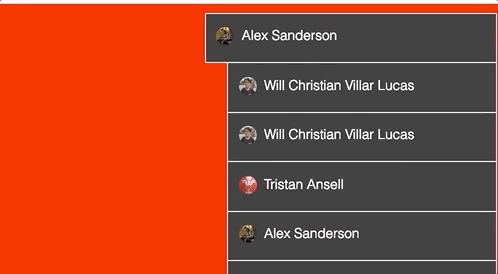

# Instructions

- Open OBS
- Add a Browser source with the following options:
    - URL: https://www.facebook.com/gaming/streamer/alertlist/?star_alerts=false&share_alerts=true&charitable_donation_alerts=false&star_sounds=false&supporter_alerts=false&clip_alerts=false
    - Width: 330px
    - Height: 600px
    - FPS: 60
    - Custom CSS: (Copy and paste the contents of [style.css](style.css) into this field)

# Example
> The red background is just so you can see the border, the actual background will be transparent.

